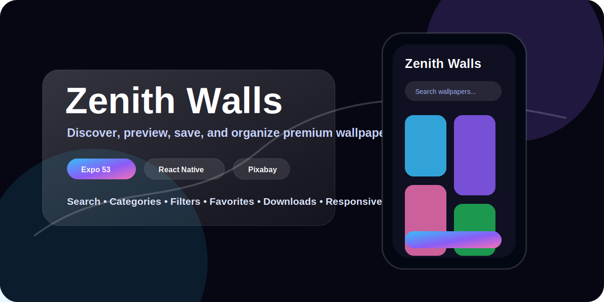
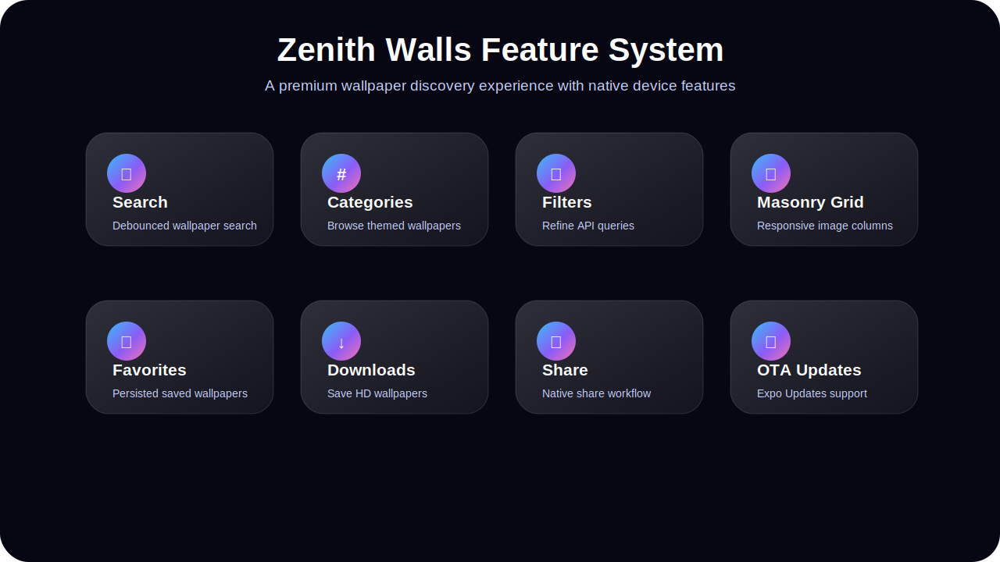
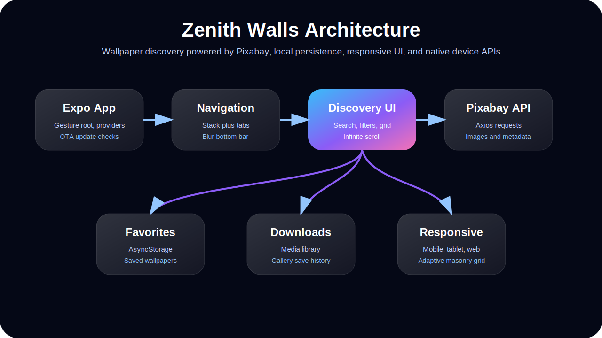
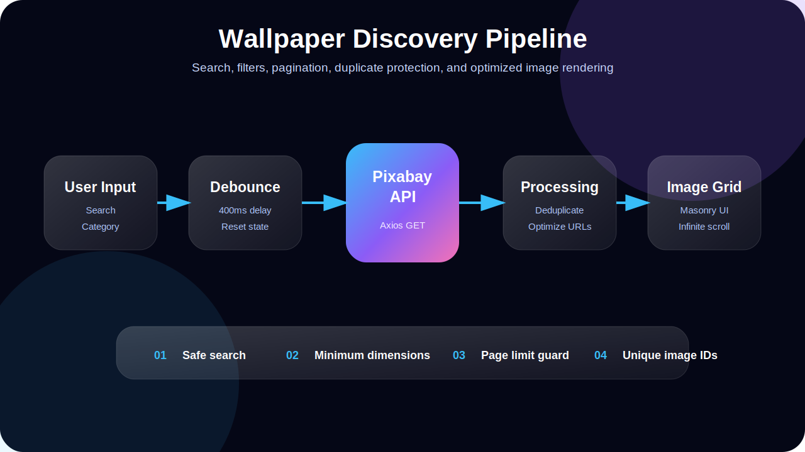
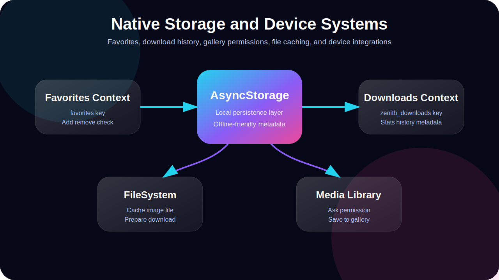

<div align="center">



# 🖼️ Zenith Walls

### Premium wallpaper discovery, preview, favorites, and downloads app

A modern Expo React Native wallpaper application with search, categories, filters, masonry-style image grids, wallpaper preview, favorites, download history, responsive layouts, and native device integrations.

Built with **Expo 53**, **React Native**, **React Navigation**, **Axios**, **AsyncStorage**, **Expo FileSystem**, **Expo Media Library**, **Reanimated**, and **FlashList**.

</div>

---

## Table of Contents

- [Overview](#overview)
- [Feature Showcase](#feature-showcase)
- [Core Features](#core-features)
- [Tech Stack](#tech-stack)
- [System Architecture](#system-architecture)
- [Application Flow](#application-flow)
- [Wallpaper Discovery Pipeline](#wallpaper-discovery-pipeline)
- [Search, Filters, and Pagination](#search-filters-and-pagination)
- [Favorites System](#favorites-system)
- [Download and Native Storage System](#download-and-native-storage-system)
- [Preview Experience](#preview-experience)
- [Responsive Design](#responsive-design)
- [API Integration](#api-integration)
- [Local Data Model](#local-data-model)
- [Folder Structure](#folder-structure)
- [Important Files](#important-files)
- [Security Notes](#security-notes)
- [Installation](#installation)
- [Available Scripts](#available-scripts)
- [Future Improvements](#future-improvements)
- [Author](#author)

---

## Overview

**Zenith Walls** is a mobile-first wallpaper discovery app designed to help users explore, preview, save, and organize high-quality wallpapers.

The app fetches wallpaper data from Pixabay, formats request parameters, filters duplicate results, optimizes image URLs, and renders wallpapers through a premium dark UI with a responsive masonry-style grid.

It is built as a complete wallpaper experience rather than a simple image list. The app includes discovery, search, filters, categories, preview, favorites, downloads, profile, settings, privacy, terms, and about screens.

---

## Feature Showcase



---

## Core Features

- Wallpaper discovery from Pixabay API.
- Debounced keyword search.
- Category-based browsing.
- Filter modal with active filter chips.
- Infinite scroll pagination.
- Pull-to-refresh.
- Duplicate wallpaper prevention.
- Optimized image URL handling.
- Responsive masonry-style image grid.
- Wallpaper preview screen.
- Similar wallpaper recommendations.
- Favorites system with local persistence.
- Download history with local persistence.
- Gallery save workflow using Expo native device APIs.
- Share workflow.
- Profile and settings screens.
- Privacy, terms, and about screens.
- Responsive web support.
- Expo OTA update checks.

---

## Tech Stack

### Core

- Expo 53
- React Native 0.79
- React 19
- TypeScript
- JavaScript

### Navigation

- React Navigation Native
- Native Stack Navigator
- Bottom Tabs Navigator

### Networking and Storage

- Axios
- AsyncStorage
- Expo FileSystem
- Expo Media Library

### UI and Animation

- Expo Linear Gradient
- Expo Blur
- React Native Reanimated
- React Native Gesture Handler
- Expo Vector Icons
- Gorhom Bottom Sheet
- React Native Modalize

### Performance

- Shopify FlashList
- Lodash debounce
- Image caching
- Responsive grid calculations
- Memoized rendering

---

## System Architecture



```text
Expo App
  ↓
GestureHandlerRootView
  ↓
Global Context Providers
  ↓
Navigation Layer
  ↓
Wallpaper Discovery UI
  ↓
Pixabay API Client
  ↓
Image Grid and Preview
  ↓
Favorites and Downloads Context
  ↓
AsyncStorage plus Media Library
```

The app uses a provider-based architecture where favorites, profile data, and downloads are managed globally through React Context providers.

---

## Application Flow

```text
App.tsx
  │
  ▼
GestureHandlerRootView
  │
  ▼
FavoritesProvider
  │
  ▼
Appnavigation
  │
  ├── ProfileProvider
  ├── FavoritesProvider
  ├── DownloadsProvider
  ├── BottomSheetModalProvider
  └── NavigationContainer
```

### Main Navigation

```text
Stack Navigator
  ├── SplashScreen
  ├── Welcome
  ├── Home
  │     └── Bottom Tabs
  │           ├── HomeTab
  │           └── ProfileTab
  ├── Preview
  ├── Favorites
  ├── Downloads
  ├── EditProfile
  ├── Settings
  ├── PrivacyPolicy
  ├── TermsOfService
  └── About
```

---

## Wallpaper Discovery Pipeline



```text
User opens Home
      │
      ▼
Home calls fetchImages()
      │
      ▼
fetchImages builds optimized request params
      │
      ▼
apiCall(params)
      │
      ▼
formatUrl(params)
      │
      ▼
Axios GET request to Pixabay
      │
      ▼
Response images are processed
      │
      ▼
Duplicate images are filtered
      │
      ▼
Images are rendered in ImageGrid
```

The discovery screen protects performance by limiting page size, enabling safe search, requesting minimum image dimensions, avoiding duplicate IDs, and using smaller web image URLs for grid rendering.

---

## Search, Filters, and Pagination

### Search Flow

```text
User types search query
      │
      ▼
Debounce waits 400ms
      │
      ▼
If query length is greater than 2
      │
      ▼
Reset page, images, loaded IDs, category
      │
      ▼
Fetch matching wallpapers
```

### Pagination Flow

```text
User scrolls near bottom
      │
      ▼
handleLoadMore()
      │
      ▼
Increase page number
      │
      ▼
Fetch next page
      │
      ▼
Append new unique images
```

### Filter Flow

```text
User opens filter modal
      │
      ▼
User selects filter values
      │
      ▼
Applyfilter() closes modal
      │
      ▼
Current images reset
      │
      ▼
Filtered request is sent
      │
      ▼
Active filter chips appear
```

---

## Favorites System

Favorites are managed with React Context and AsyncStorage.

```text
favorites
  ├── addToFavorites(wallpaper)
  ├── removeFromFavorites(wallpaperId)
  └── isFavorite(wallpaperId)
```

### Persistence Key

```text
favorites
```

The favorites system is local-first. It stores wallpaper metadata on the device so users can return to previously saved wallpapers without creating an account.

---

## Download and Native Storage System



Downloads are managed with `DownloadsContext` and Expo native APIs.

```text
User taps download
      │
      ▼
Request gallery permission
      │
      ▼
Download image to local cache
      │
      ▼
Save file to gallery
      │
      ▼
Add wallpaper metadata to downloads context
      │
      ▼
Persist download history in AsyncStorage
```

### Download Context Capabilities

```text
downloads
  ├── addDownload(wallpaperData)
  ├── removeDownload(downloadId)
  ├── isDownloaded(wallpaperId)
  ├── getDownload(wallpaperId)
  ├── clearAllDownloads()
  ├── getDownloadsByCategory(category)
  ├── getRecentDownloads(limit)
  ├── getDownloadStats()
  └── updateDownloadLocalPath(downloadId, localPath)
```

### Persistence Key

```text
zenith_downloads
```

---

## Preview Experience

The preview screen includes:

- Animated screen entrance.
- Large wallpaper display.
- Loading state for the image.
- Author name.
- Resolution.
- Views.
- Download count.
- Tags.
- Favorite toggle.
- Share action.
- Details modal.
- Similar wallpapers list.
- Download button.

---

## Responsive Design

Zenith Walls includes responsive utilities for mobile, tablet, desktop, large desktop, and ultra-wide layouts.

The app adjusts:

- Grid column count.
- Container width.
- Spacing.
- Font sizes.
- Bottom tab height.
- Image dimensions.
- Hover behavior on supported platforms.

---

## API Integration

The API layer is located in:

```text
src/API/index.js
```

### API Flow

```text
apiCall(params)
      │
      ▼
formatUrl(params)
      │
      ▼
Append query params
      │
      ▼
Axios GET request
      │
      ▼
Return success or error object
```

### Default API Behavior

- Uses Pixabay API.
- Enables safe search.
- Enables editor's choice by default.
- Encodes search query values.
- Returns structured success or failure objects.

---

## Local Data Model

### Favorite Wallpaper Object

```text
favoriteWallpaper
├── id
├── webformatURL
├── largeImageURL
├── imageWidth
├── imageHeight
├── user
├── tags
├── views
└── downloads
```

### Download Object

```text
download
├── id
├── imageWidth
├── imageHeight
├── largeImageURL
├── webformatURL
├── user
├── tags
├── views
├── downloads
├── category
├── downloadedAt
├── fileName
├── fileSize
└── localPath
```

---

## Folder Structure

```text
zenithwalls/
├── assets/
│   └── readme/
│       ├── hero-banner.svg
│       ├── app-architecture.svg
│       ├── feature-showcase.svg
│       ├── discovery-pipeline.svg
│       └── native-systems.svg
│
├── src/
│   ├── API/
│   ├── components/
│   ├── constants/
│   ├── helpers/
│   ├── screens/
│   └── utils/
│
├── App.tsx
├── package.json
└── README.md
```

---

## Important Files

### App.tsx

Main app bootstrap file. It injects web styles, checks for Expo OTA updates, wraps the app in `GestureHandlerRootView`, provides favorites state, renders the status bar, and mounts the navigation tree.

### src/screens/navigator/Appnavigation.js

Defines the app navigation system, stack routes, bottom tabs, blur tab background, and global providers.

### src/screens/ProjectScreens/Home.js

Main discovery screen. Handles search, pagination, filtering, categories, pull-to-refresh, duplicate prevention, infinite scroll, and wallpaper loading.

### src/API/index.js

Pixabay API integration layer. Builds request URLs, appends params, performs Axios requests, and returns structured responses.

### src/components/ImageGrid.js

Responsive masonry-style image grid. Handles image caching, retry logic, adaptive columns, loading states, and navigation to the preview screen.

### src/screens/ProjectScreens/PreviewScreen.js

Full wallpaper preview screen with download, favorite, share, details, metadata, and similar wallpaper features.

### src/constants/FavoritesContext.js

Global favorites state manager backed by AsyncStorage.

### src/constants/DownloadsContext.js

Global download history manager backed by AsyncStorage.

---

## Security Notes

This repository currently includes a Pixabay API key directly inside the API file. Before production deployment, move API credentials into environment variables.

Recommended production improvements:

- Move API keys to `.env`.
- Use `EXPO_PUBLIC_PIXABAY_API_KEY` for Expo configuration.
- Add request failure UI for API limits or network errors.
- Add rate-limit handling.
- Avoid logging sensitive errors in production.
- Review media permissions for Android and iOS deployment.
- Add privacy disclosures for downloads and gallery access.

---

## Installation

```bash
git clone https://github.com/codewithmoju/zenithwalls.git
cd zenithwalls
npm install
```

---

## Available Scripts

```bash
npm start
npm run android
npm run ios
npm run web
```

---

## Future Improvements

- Move Pixabay API key to environment variables.
- Add real app screenshots or GIF demo.
- Add offline favorites cache with thumbnails.
- Add wallpaper collections.
- Add user-created albums.
- Add advanced filter presets.
- Add trending wallpapers section.
- Add image color extraction.
- Add dark and light theme switching.
- Add download progress indicators.
- Add better error and retry UI for failed requests.
- Add unit tests for utilities and contexts.
- Add EAS Build configuration documentation.
- Add app store deployment documentation.

---

## Engineering Highlights

This repository demonstrates:

- Expo React Native app architecture.
- React Navigation stack and tab routing.
- External image data integration.
- Debounced search.
- Infinite scrolling.
- Responsive masonry image grid.
- Duplicate result filtering.
- Expo FileSystem image caching.
- Expo Media Library downloads.
- AsyncStorage-backed favorites and downloads.
- Haptic feedback.
- Blur and glassmorphism UI patterns.
- Responsive web support.
- Expo OTA update checks.

---

## Author

**Muhammad Moaiz**  
React Native Developer  
Expo • React Native • Mobile UI Engineering • API Integration

---

## License

This project is available for learning, portfolio, and demonstration purposes.
